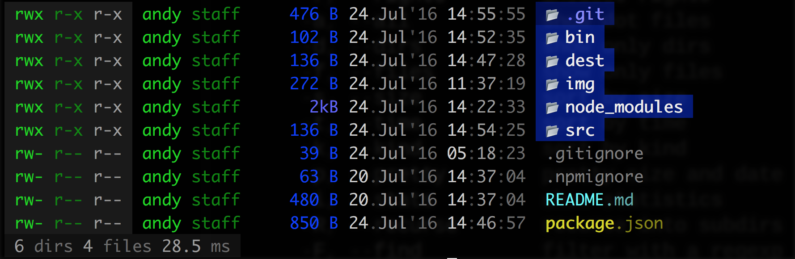
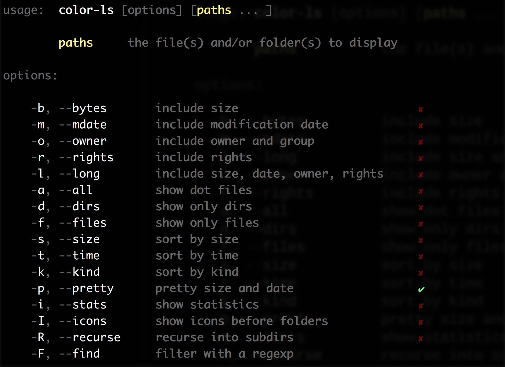
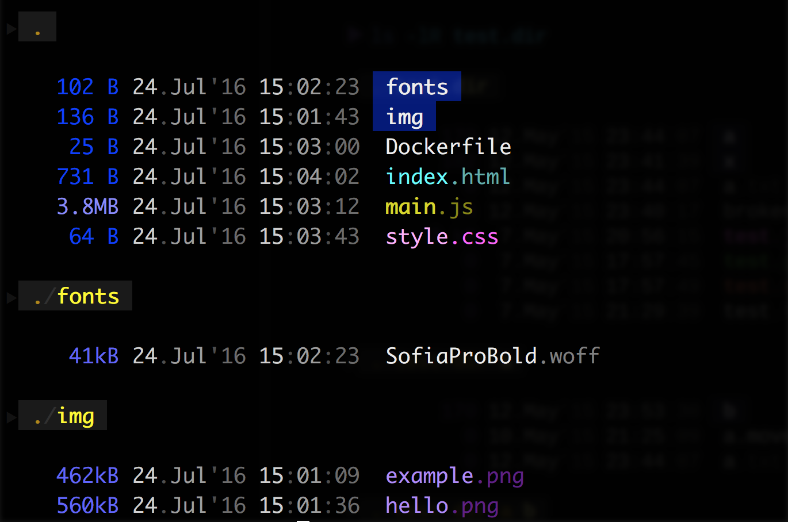

# ls-color

#### A colorful alternative to the `ls` command.
List the contents of your folders in beautiful, semantic colors.
```
$ ls-color -aliI
```


This is a fork of [monsterkodi/color-ls](https://github.com/monsterkodi/color-ls).

## Getting started
**A terminal with 256-color is required.** Intended for dark backgrounds.
```sh
$ [sudo] npm install -g ls-color
# I recommend aliasing ls-color to something less verbose
$ alias ll="ls-color -aliI"
```

## Usage
See the full options. The `--pretty` option is enabled by default.
```
ls-color -h
```



### Recursion



